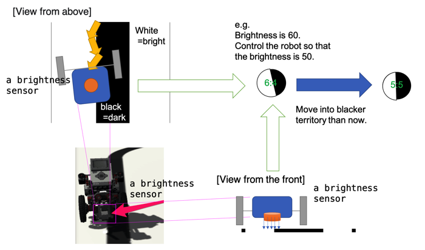

# ros_hackev_linetracer


This repository shows how to use the system test function of R2S2 (RDBOX Robotics Simulation System).  

You will first learn how to run a ROS package in **a standalone container** .  

## Subject



We will use a robot called ev3rt.  
This robot uses PID control to perform smooth line tracing.  
PID control is performed based on the value of a brightness sensor attached to the bottom of the robot.  
Test that it reaches the goal more quickly and accurately by changing various parameters of the PID.

## The ROS Topics and Nodes


- Nodes
  - mROS App
    - It runs on the athrill.
  - repeater_for_ev3rt
    - An intermediate process to accept IP addresses from arbitrary Pods when running on kubernetes.
At the same time, it also exposes information obtained from wheels such as odom and path.
  - **ros_hackev_lintracer(this app)**
    - Input the value of the brightness sensor (ev3rt/color_sensor_reflect) to calculate the PID control and output the steering amount of the steering wheel (ev3rt/motor_steer).
- Topics
  - ev3rt/color_sensor_reflect
    - int(0-100)%
  - ev3rt/color_sensor_color
    - enum(NONE, BLACK, BLUE, GREEN, YELLOW, RED, WHITE, BROWN)
  - ev3rt/motor_counts
    - int deg
  - ev3rt/motor_steer
    - int(-100-100)%

## Usage

### Clone

```bash
git clone --recursive https://github.com/rdbox-intec/ros_hackev_linetracer.git
```

### Run

```bash
roslaunch ros_hackev_linetracer linetracer.launch white:=80.0 black:=20 kp:=1.8 ki:=1.67 kd:=0.0324 td:=0.027 power:=10
```

This brightness is based on color_sensor_reflect.

|  item   |  value      | description                  |
| ------- | ----------  |  --------------------------  |
|  white  | int(0-100)% | Brightness of white ground   |
|  black  | int(0-100)% | Brightness of black ground   |
|  kp     | float       | parameter of PID control     |
|  ki     | float       | parameter of PID control     |
|  kd     | float       | parameter of PID control     |
|  td     | float       | parameter of PID control     |
|  power  | int(0-100)% | motor power                  |

### Unit Test (with ROSTEST)

```bash
rostest ros_hackev_linetracer default.test
```

### System Test (with R2S2)

```bash
docker run --rm --env-file=/tmp/env-file -v "$R2S2_CERT":"$R2S2_CERT" "$BUILD_IMAGE_NAME" rostest ros_hackev_linetracer integratin.test
```

## Detail about test

The two types of testing methods are described below.

- Unit Test
- System Test

### Unit Test

ROS provides rotest as a runner for unit tests. See the [rostest \- ROS Wiki](http://wiki.ros.org/rostest) for more details.  
Based on the above ROS Wiki article, we have implemented the following test file. This will be very helpful for you.  

- [default.test](./ros_hackev_linetracer/test/default.test)
- [test_linetracer.py](./ros_hackev_linetracer/scripts/test_linetracer.py)
- [mock.py](./ros_hackev_linetracer/scripts/mock.py)

### System Test

TBD
